# 🎮 Cómo Jugar

Tu camino de novato a campeón en 6 niveles.

---

## 🗺️ Tu Mapa de Ruta

```
🔓 NIVEL 1: Únete a la Comunidad
       ↓
🔒 NIVEL 2: Crea tu Bóveda Digital
       ↓
🔒 NIVEL 3: Consigue tus Dólares Digitales
       ↓
🔒 NIVEL 4: Activa tu Entrada Founder
       ↓
   ⭐ DESBLOQUEADO: PROGRAMA FOUNDERS
       ├── 🏆 Torneos Beta
       ├── 💬 Founders Lounge
       ├── 🎁 Rifa Mystery Boxes
       └── 🏅 Insignia Founder
       ↓
🔒 NIVEL 5: Entrena en Torneos Beta
       ↓
🔒 NIVEL 6: ¡A Conquistar el Mundial!
```

---

## 🔓 NIVEL 1: Únete a la Comunidad

**Objetivo:** Conocer CoinMatch Pool y unirte al grupo

⏱️ **Tiempo:** 2 minutos

### Qué hacer:

1. **Únete al Canal Oficial**
   - Aquí publicamos anuncios y novedades
   - Solo lectura (nosotros publicamos, tú lees)

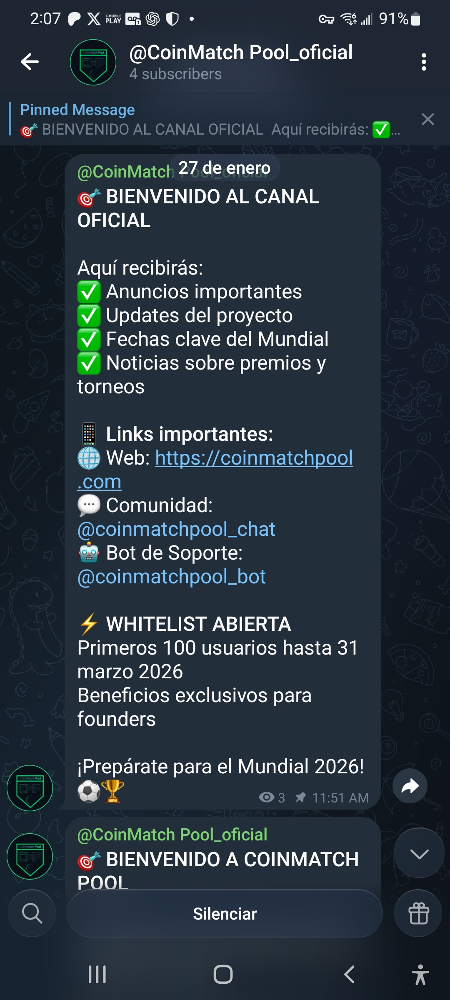

2. **Únete al Grupo Comunidad**
   - Aquí puedes hablar con otros participantes
   - Resuelve dudas, comparte estrategias

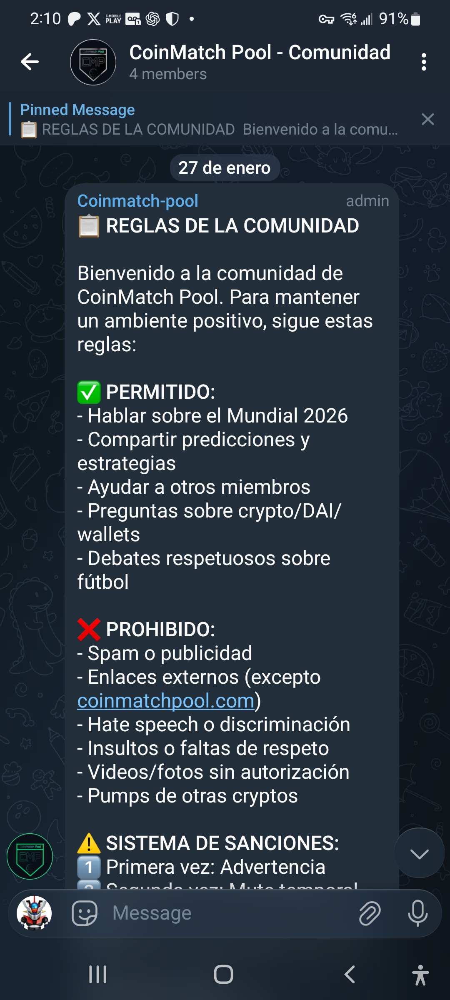

3. **Activa el Bot** — escribe `/start` para comenzar
   - Tu asistente personal 24/7
   - Al iniciar, el bot te da la bienvenida y te muestra todos los comandos disponibles

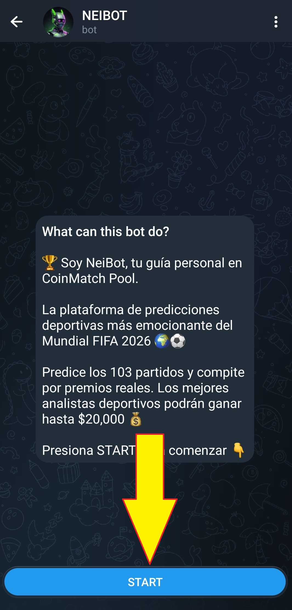

### ✅ Nivel Completado cuando:
- Estás en el Canal Oficial
- Estás en el Grupo Comunidad
- El bot te dio la bienvenida

🎁 **Recompensa:** Acceso a toda la información del proyecto

---

## 🔓 NIVEL 2: Crea tu Bóveda Digital

**Objetivo:** Crear tu billetera para guardar dinero digital

⏱️ **Tiempo:** 5 minutos

### ¿Qué es una Bóveda Digital?

Es como una **caja fuerte en tu celular** donde guardas tu dinero digital. Solo tú tienes la llave (tu contraseña secreta).

### Qué hacer:

1. **Descarga MetaMask** (gratis)
   - [iPhone](https://apps.apple.com/app/metamask/id1438144202)
   - [Android](https://play.google.com/store/apps/details?id=io.metamask)

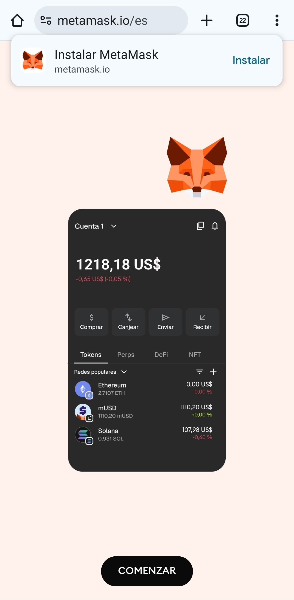

**Otras wallets compatibles:**
- Trust Wallet
- Coinbase Wallet
- Cualquier wallet compatible con WalletConnect

**Recomendamos MetaMask** por ser la más popular y fácil de usar, y porque tiene navegador interno integrado (lo necesitarás en el Nivel 4).

2. **Crea tu cuenta**
   - Abre la app
   - Toca "Crear nueva billetera"
   - Crea una contraseña segura

3. **Guarda tu Frase Secreta** ⚠️ MUY IMPORTANTE
   - MetaMask te dará 12 palabras
   - Escríbelas en papel (NO en el celular)
   - Guárdalas en lugar seguro
   - **NUNCA las compartas con nadie**

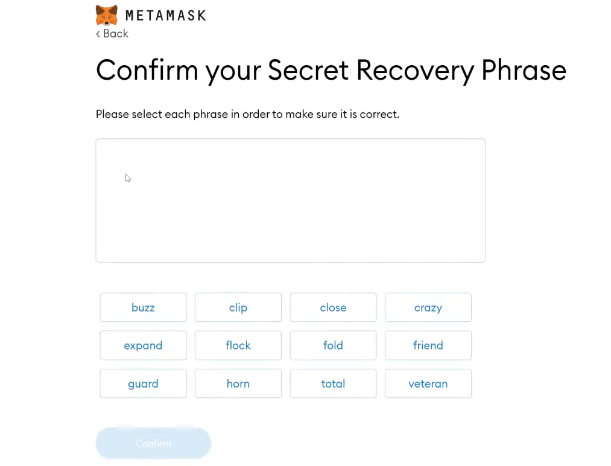

4. **Agrega la Red Polygon**
   - Es la red blockchain donde se procesan los pagos de CoinMatch Pool
   - En MetaMask, toca el ícono de redes (arriba a la derecha) y selecciona **Polygon**

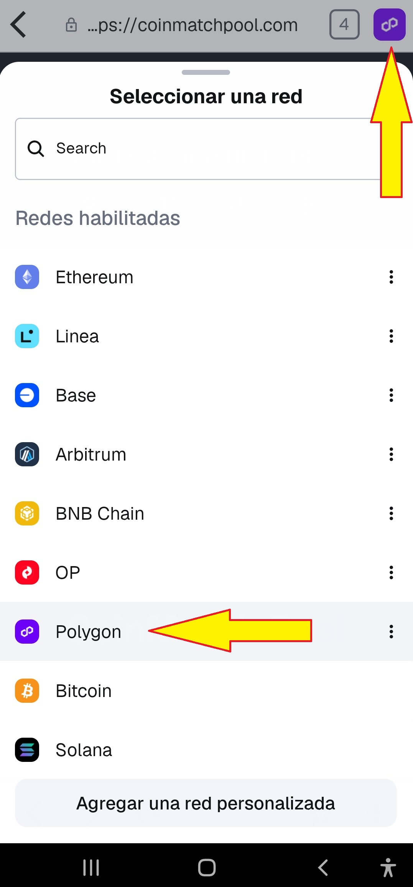

   - Si no aparece, escribe **`/wallet`** en el bot para ver el tutorial paso a paso

### ✅ Nivel Completado cuando:
- Tienes MetaMask instalada
- Guardaste tu frase secreta en papel
- Tienes la red Polygon configurada

🎁 **Recompensa:** 🎖️ Badge "Bóveda Creada" (listo para recibir premios)

---

## 🔓 NIVEL 3: Consigue tus Dólares Digitales

**Objetivo:** Tener al menos $30 DAI en red Polygon, listos para cuando abra el countdown

⏱️ **Tiempo:** 10-15 minutos

### ¿Qué es DAI?

- **1 DAI = 1 dólar** (siempre, no sube ni baja)
- Es dinero digital que puedes enviar a cualquier parte del mundo
- Lo usamos porque es transparente y seguro

### Qué hacer:

**Opción A: Comprar con tarjeta (más fácil)**

1. Abre MetaMask
2. Toca "Comprar"
3. Selecciona tu país y método de pago
4. Compra **$35 DAI** (un poco extra para comisiones de red)

**Comisión:** ~3-5% pero TODO en un solo paso.

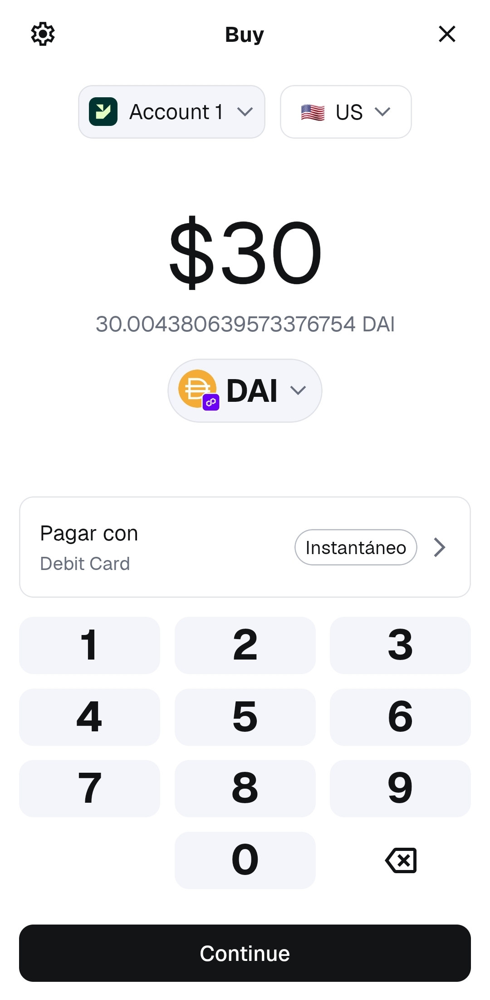

**Opción B: Usar un exchange (más barato)**

- **Colombia:** Binance
- **México:** Bitso
- **USA:** Coinbase
- **Otros:** Binance

**Proceso:**
1. Crea cuenta en el exchange
2. Compra DAI
3. Envía a tu bóveda (red Polygon)

**Comisión:** ~0.5-1% pero más pasos (crear cuenta, KYC, transferir).

💡 **¿Necesitas ayuda?** Escribe al bot: `/dai`

### ✅ Nivel Completado cuando:
- Tienes al menos $30 DAI en tu bóveda
- Puedes verlos en MetaMask (red Polygon)

🎁 **Recompensa:** 🎖️ Badge "Fondos Listos"

---

## 🔓 NIVEL 4: Activa tu Entrada Founder

**Objetivo:** Vincular tu wallet con tu cuenta de Telegram y pagar tu entrada

⏱️ **Tiempo:** 5 minutos

### FLUJO DE REGISTRO COMPLETO:

---

#### Paso 1 — Obtén tu código de vinculación en el bot

En el bot de Telegram, escribe **`/vincular`**

El bot te responderá con un **código de 6 caracteres** (ej: `7YRU54`) válido por **10 minutos**.

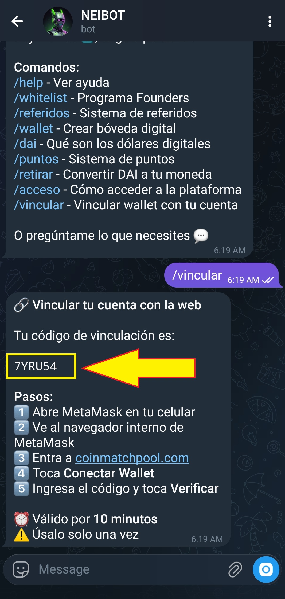

⚠️ **Úsalo solo una vez** — si expira, escribe `/vincular` nuevamente para obtener uno nuevo.

---

#### Paso 2 — Abre coinmatchpool.com desde MetaMask

Debes acceder a la web **desde el navegador interno de MetaMask** para que la wallet se conecte automáticamente.

1. Abre MetaMask
2. Toca **"Explorar"** en la barra inferior

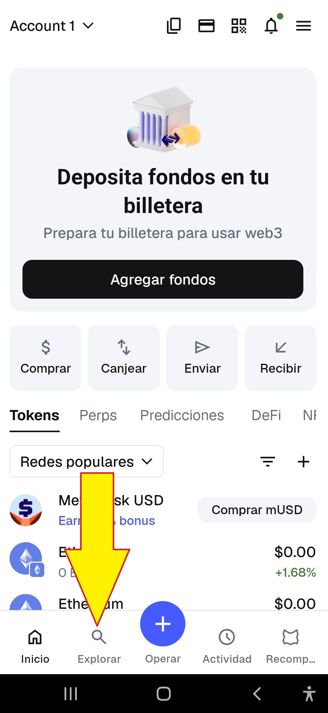

3. Toca la barra de búsqueda

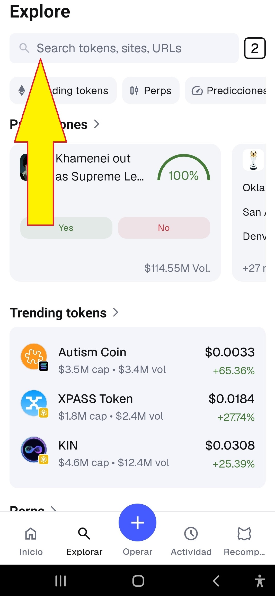

4. Escribe **`coinmatchpool.com`** y toca el resultado

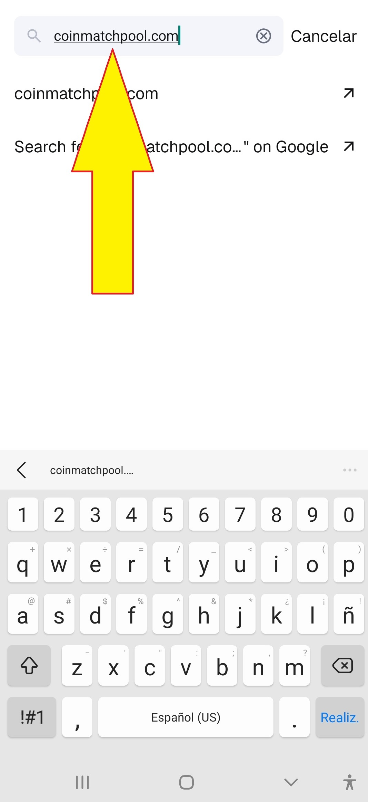

---

#### Paso 3 — Conecta tu wallet

En la web, toca el botón **WALLET** (arriba a la derecha)

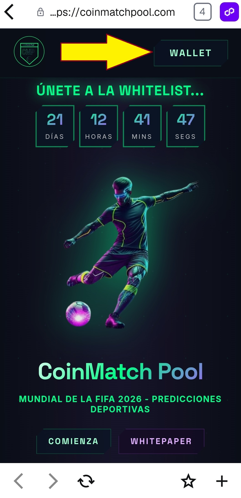

MetaMask te pedirá confirmar la conexión — toca **Conectar**

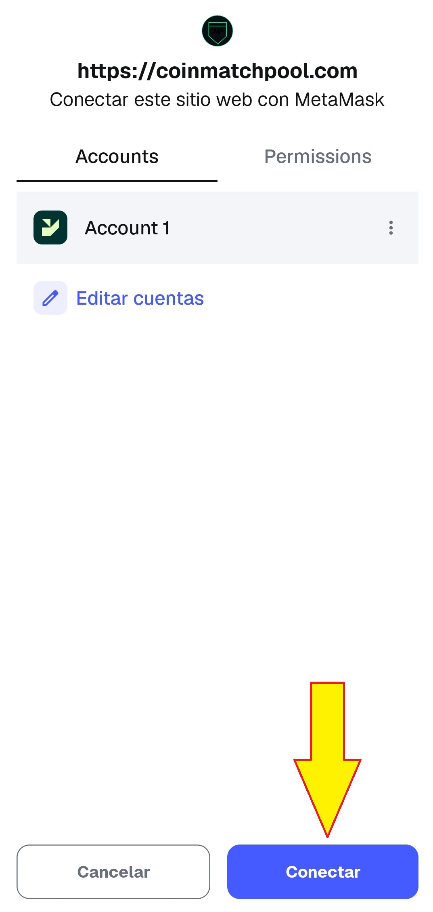

Luego te pedirá **firmar un mensaje** para verificar que eres el dueño de la wallet — toca **Confirmar**

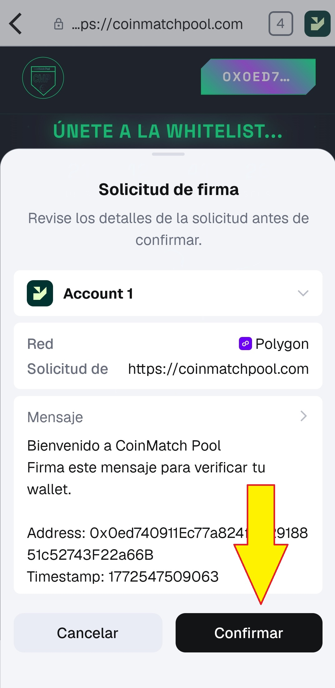

---

#### Paso 4 — Ingresa el código y verifica

La web mostrará un campo para ingresar tu código. Escribe el código que obtuviste en el Paso 1 y toca **VERIFICAR**

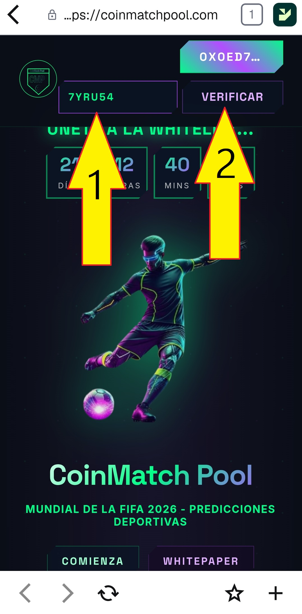

✅ ¡Listo! Tu wallet y tu Telegram quedan vinculados. Tu cuenta está creada.

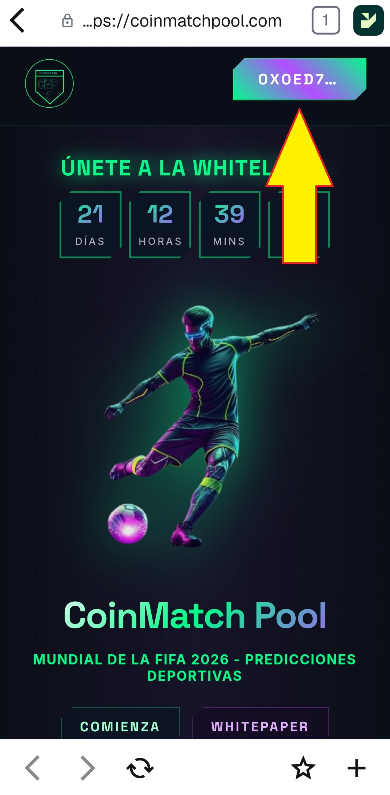

---

#### Paso 5 — Adquiere tus DAI y espera el countdown

Asegúrate de tener al menos **30 DAI en red Polygon** en tu wallet (+ un poco extra para comisiones). Tenlos listos antes de que termine el countdown.

---

#### Paso 6 — Paga tu entrada cuando el countdown llegue a cero

Cuando el countdown llegue a **00:00:00:00**, aparecerá el botón de pago. Realiza la transacción de **30 DAI** y confirma en MetaMask.

✅ ¡Inscripción completa! El bot te dará la bienvenida como **Founder**.

---

### ¿Por qué $30?

Tu entrada de $30 se distribuye así:

| Destino | Monto | Qué es |
|---------|-------|--------|
| 🏆 Pool Principal | $20 | Premios para Top 3 |
| 🎮 Mini Torneos | $1 | Premios por jornada |
| 🎁 Mystery Boxes | $2 | Cajas sorpresa |
| 👥 Referidos | $2 | Comisiones por invitar |
| ⚙️ Operación | $5 | Mantenimiento plataforma |

### ¿Tienes código de referido? (Opcional)

Si alguien te invitó, ingresa su código al registrarte:
- ✅ Tu amigo gana $2
- ✅ Tú ganas +1 Mystery Box COMÚN extra

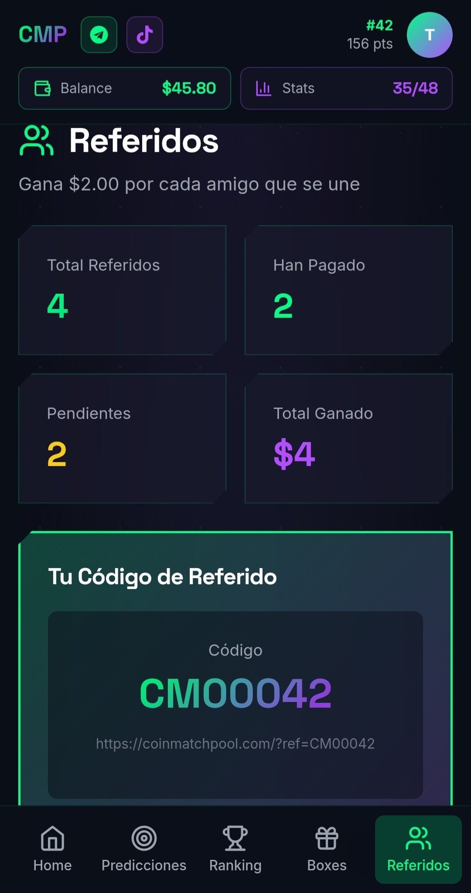

### ✅ Nivel Completado cuando:
- Tu wallet está vinculada con tu Telegram
- Realizaste el pago de 30 DAI
- El bot te dio la bienvenida como Founder

---

## ⭐ PROGRAMA FOUNDERS DESBLOQUEADO

¡Felicidades! Ahora eres uno de los **primeros 100 Founders**.

### Beneficios Exclusivos:

#### 🏆 Torneos Beta (Marzo-Abril-Mayo 2026)

3 torneos de práctica para aprender el sistema:

| Torneo | Competencia | Partidos | Premio 1er Lugar |
|--------|-------------|----------|-----------------|
| **Beta 1** | Amistosos Fecha FIFA | ~10 | **Devolución de tus $30** |
| **Beta 2** | Liga BetPlay Colombia | ~10 | **Devolución de tus $30** |
| **Beta 3** | Liga MX | ~10 | **Devolución de tus $30** |

**¿Ganaste un Torneo Beta?** → Recuperas tu entrada completa  
**¿No ganaste?** → Ya estás inscrito para el Mundial

#### 💬 Founders Lounge

Grupo privado de Telegram solo para los 100 Founders:
- Comunicación directa con el equipo
- Novedades antes que nadie
- Voz en decisiones del proyecto

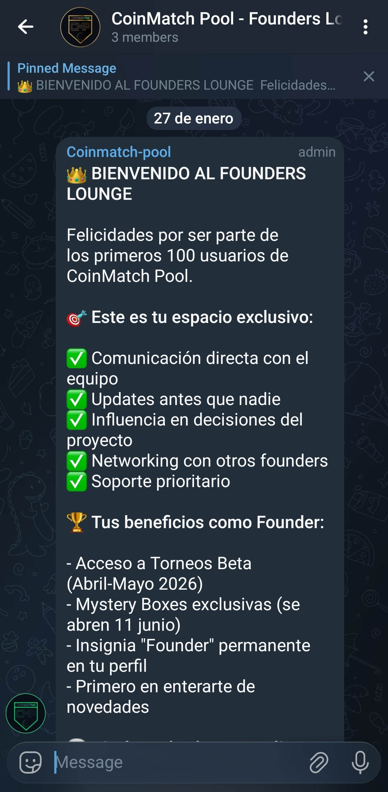

#### 🎁 Rifa Mystery Boxes Exclusiva

- Cada Founder recibe 1 caja de rifa especial
- Algunas tienen premios RAROS o ÉPICOS
- Otras están vacías (es rifa)
- Se abren el 11 de junio 2026 (inicio del Mundial)

#### 🏅 Insignia "Founder"

Badge permanente en tu perfil que todos verán:
- En el ranking
- En tu perfil público
- Para siempre

---

## 🔓 NIVEL 5: Entrena en Torneos Beta

**Objetivo:** Practicar y competir por la devolución de tu entrada

⏱️ **Duración:** Marzo-Abril-Mayo 2026

### ¿Cómo funcionan?

1. **Recibes notificación** cuando abre un torneo
2. **Accedes al dashboard** web
3. **Predices marcadores** de cada partido
4. **Acumulas puntos** según tus aciertos
5. **Si quedas 1ro** → Recuperas tus $30

### Sistema de Puntos (Beta usa el mismo del Mundial):

| Acierto | Puntos |
|---------|--------|
| Marcador exacto (ej: 2-1) | 3 pts |
| Resultado correcto (ej: gana local) | 1 pt |
| Fallo | 0 pts |

### Calendario Beta:

| Torneo | Fecha | Partidos |
|--------|-------|----------|
| Beta 1: Amistosos FIFA | Marzo 2026 | ~10 |
| Beta 2: Liga BetPlay | Abril 2026 | ~10 |
| Beta 3: Liga MX | Mayo 2026 | ~10 |

### ✅ Nivel Completado cuando:
- Participaste en al menos 1 torneo Beta
- Ya conoces el sistema de predicciones

🎁 **Recompensa:** Experiencia + posibilidad de recuperar tu entrada

---

## 🔓 NIVEL 6: ¡A Conquistar el Mundial!

**Objetivo:** Predecir los 103 partidos y ganar premios

⏱️ **Duración:** 11 Junio - 19 Julio 2026

### El Gran Juego

- **103 partidos** para predecir
- **8 jornadas** con deadlines independientes
- **Puntos progresivos** (más puntos en fases finales)

### Sistema de Puntos Mundial:

| Fase | Marcador Exacto | Resultado Correcto |
|------|----------------|-------------------|
| Grupos | 3 pts | 1 pt |
| Dieciseisavos | 5 pts | 2 pts |
| Octavos | 8 pts | 3 pts |
| Cuartos | 12 pts | 5 pts |
| Semifinales | 20 pts | 8 pts |
| Final | 30 pts | 10 pts |

### Cómo Predecir:

1. **Accede al dashboard:** [coinmatchpool.com/dashboard](https://coinmatchpool.com/dashboard)
2. **Selecciona la jornada**
3. **Ingresa tus marcadores** para cada partido
4. **Guarda** antes del deadline

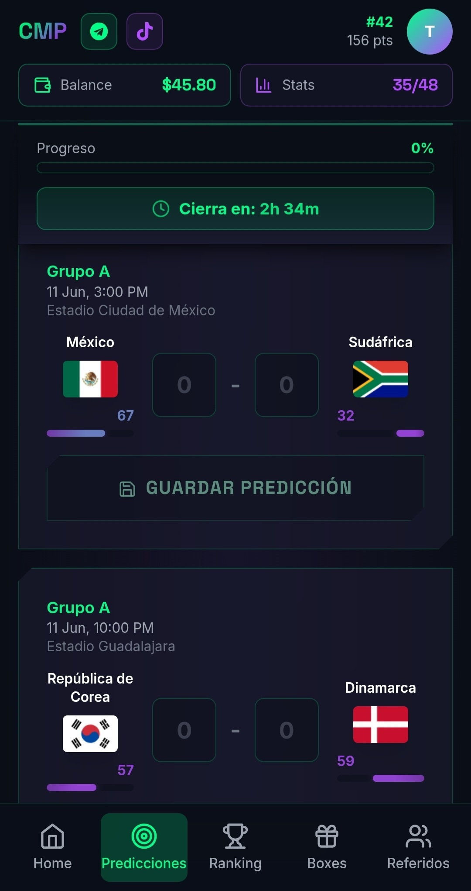

⚠️ **IMPORTANTE:** Después del deadline NO puedes cambiar predicciones

### Formas de Ganar:

| Categoría | Qué es | Ejemplo (1,000 jugadores) |
|-----------|--------|--------------------------|
| 🏆 Pool Principal | Top 3 ranking final | 1ro: $10,000 / 2do: $6,000 / 3ro: $4,000 |
| 🎮 Mini Torneos | Top 3 por jornada | ~$50-125 por torneo |
| 🎁 Mystery Boxes | Cajas sorpresa | $0 - $80 por caja |
| 👥 Referidos | $2 por amigo | $2 × cada amigo que pague |

### ✅ Nivel Completado cuando:
- Completaste todas tus predicciones
- Esperaste al 19 de julio (Final del Mundial)
- Recibiste tus premios (25 de julio)

🎁 **Recompensa:** ¡Tus ganancias en dólares digitales!

---

## ⏰ Fechas Importantes

| Fecha | Evento |
|-------|--------|
| **Marzo 1-22** | Abre inscripción Founders (100 spots) |
| **22 Marzo 2026** | ⏰ Cierra inscripción Founders |
| **Marzo 23-31** | Torneo Beta 1: Amistosos FIFA |
| **Abril 2026** | Torneo Beta 2: Liga BetPlay Colombia |
| **Mayo 2026** | Torneo Beta 3: Liga MX |
| **Mayo 15-31** | Early Bird General |
| **Junio 1-9** | Inscripción general |
| **11 Junio 2026** | 🏆 INICIA EL MUNDIAL |
| **19 Julio 2026** | Final del Mundial |
| **25 Julio 2026** | 💰 Distribución de premios |

---

## 💸 Cómo Retirar tus Ganancias

Cuando ganes premios, puedes retirarlos a tu bóveda:

1. Ve a **Dashboard → Retiros**
2. Ingresa el monto (mínimo $10)
3. Confirma tu dirección de bóveda
4. Espera 24-48 horas (revisión manual)
5. ✅ Recibes tus dólares digitales

**Sin comisiones** de retiro.

---

## ❓ Preguntas Rápidas

**¿Puedo participar sin saber de cripto?**
✅ Sí, el bot te guía paso a paso. Miles de personas aprenden cada día.

**¿Es seguro guardar dinero en una billetera?**
✅ Sí. MetaMask es usado por millones. Tu dinero está en la blockchain (no en nuestros servidores).

**¿Qué pasa si mi código de vinculación expira?**
✅ Escribe `/vincular` nuevamente en el bot para obtener un código nuevo. Son válidos por 10 minutos.

**¿Qué pasa si me equivoco en una predicción?**
✅ Nada, simplemente no ganas puntos en ese partido. El sistema es automático.

**¿Puedo cambiar mis predicciones?**
❌ NO después del deadline de cada jornada. Antes sí.

**¿Dónde puedo hacer preguntas?**
📱 Escribe al bot en Telegram: `/help` o pregunta en el Grupo Comunidad.

---

## 🚀 Acceso a la Plataforma

CoinMatch Pool es una **Progressive Web App (PWA)** — no requiere descarga desde ninguna tienda. Se instala directamente desde el navegador en cualquier dispositivo.

### Instalación en iPhone (Safari)

1. Abre **Safari** y ve a `coinmatchpool.com`
2. Toca el botón de compartir (ícono de caja con flecha hacia arriba)
3. Selecciona **"Añadir a pantalla de inicio"**
4. Toca **Agregar** — la app aparecerá como ícono en tu pantalla

### Instalación en Android (Samsung Internet o Chrome)

1. Abre **Samsung Internet** o **Chrome** y ve a `coinmatchpool.com`
2. Toca el menú (3 puntos o ícono de menú)
3. Selecciona **"Añadir a pantalla de inicio"**
4. Confirma — la app aparecerá como ícono en tu pantalla

### ¿Problemas para acceder? (Usuarios T-Mobile en iPhone)

Algunos usuarios de **T-Mobile en iPhone** pueden experimentar problemas de conexión debido a configuraciones de DNS. Solución:

1. Descarga la app **1.1.1.1** de Cloudflare:
   - iPhone: [App Store](https://apps.apple.com/app/1-1-1-1-faster-internet/id1423538627)
   - Android: [Google Play](https://play.google.com/store/apps/details?id=com.cloudflare.onedotonedotonedotone)

2. Actívala — cambia tu DNS automáticamente
3. Vuelve a abrir Safari y accede a `coinmatchpool.com`

---

## 🚀 Listo para Comenzar?

1. Únete al [Canal Oficial](https://t.me/coinmatchpool)
2. Únete al [Grupo Comunidad](https://t.me/coinmatchpool_community)
3. Activa el [@CoinMatchPoolBot](https://t.me/coinmatchpool_bot)
4. Sigue los 6 niveles

¡Nos vemos en el Mundial! ⚽🏆